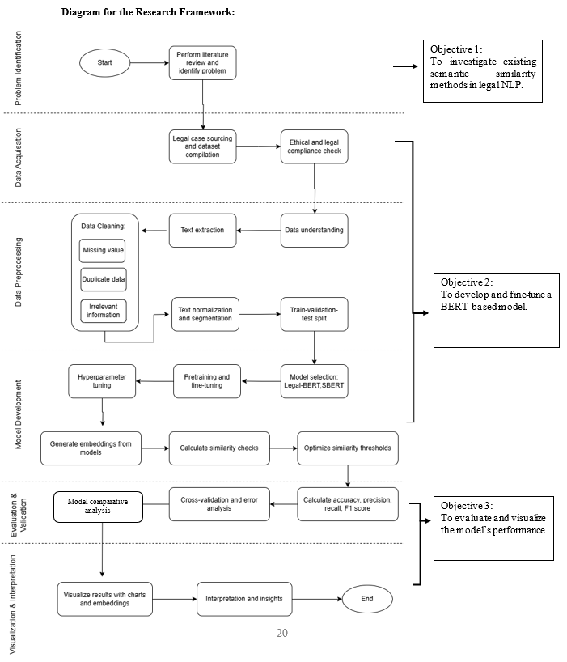

  

<table align="center">
  <tr>
    <th>Name</th>
    <th>Matric No.</th>
  </tr>
  <tr>
    <td>Muhammad Haziq Bin Mohamad</td>
    <td>MCS241036</td>
  </tr>
</table>

# BERT-BASED SEMANTIC SIMILARITY OF MALAYSIAN LEGAL PRECEDENTS

## Files

| No  | Chapter     |                                                 File |
| :-: | ---------- | :---------------------------------------------------------------------------------------------------: |
|  1.  | Proposal |  |
|  2.  | Chapter 1 |  |
|  3.  | Chapter 2 |  |
|  4.  | Chapter 3 |  |
|  5.  | Chapter 4 |  |
|  6.  | Chapter 5 |  |
|  7.  | Complete Chapter |  |
|  8.  | Code |  |

## Table of Contents
- [Abstract](#abstract)
- [Research Objectives](#research-objectives)
- [Scope of Work](#scope-of-work)
- [Methodology](#methodology)
- [Expected Outcomes](#expected-outcomes)

## Abstract

The increasing volume of digital legal documents within the Malaysian judiciary presents a significant challenge for efficient precedent analysis and legal research. Traditional keyword-based search methods often fail to capture the semantic nuances and contextual complexities inherent in legal texts, leading to incomplete or irrelevant results. Therefore, this project addresses this critical gap by investigating, developing, and evaluating a sophisticated deep learning model for semantic similarity tailored to Malaysian legal precedents. Thus, the primary objective is the development and fine-tuning of a bespoke BERT-based model, leveraging the Sentence-BERT (SBERT) architecture, to accurately quantify the semantic relationship between passages of legal text. For instance, the methodology follows a structured pipeline, commencing with the sourcing and compilation of a specialized corpus of Malaysian legal cases. A rigorous data cleaning and preprocessing phase was executed, featuring text normalization tailored to local legal statutes and terminology. The “all-MiniLM-L6-v2” model was subsequently fine-tuned on this curated dataset using a cosine similarity loss function to optimize for the semantic similarity task. Furthermore, a comprehensive, multi-faceted evaluation framework was implemented to validate the model's performance. The assessment involved quantitative analysis using a suite of metrics including accuracy, precision, recall, F1-score, and Pearson correlation, alongside a qualitative domain-specific analysis to gauge effectiveness across different areas of law. Then, the performance of the fine-tuned model was compared with other baseline model such as Bag of Words (Bow) and Term Frequency-Inverse Document Frequency (TF-IDF). The evaluation was augmented with key visualizations, including confusion matrices and score distribution plots, to provide intuitive insights into the model's predictive behavior. The results demonstrate that the fine-tuned model effectively captures the complex semantic relationships within Malaysian legal discourse, showing significant promise over generalized models. Hence, this research contributes a valuable, domain-specific tool that can enhance legal discovery, support case law analysis, and ultimately improve the efficiency of legal practitioners in Malaysia.

## Keywords

**Semantic Similarity, BERT, Legal NLP, Malaysian Legal Precedents, Legal Information Retrieval**

## Research Objectives

1. To investigate existing semantic similarity methods in the field of legal Natural Language Processing (NLP).

2. To develop and fine-tune a BERT-based model tailored for Malaysian legal case texts.

3. To evaluate and visualize model performance using comprehensive metrics and analysis.

## Scope of Work
- Fine-tune a Sentence-BERT (SBERT) model on English legal sentence pairs to predict semantic similarity.

- Use embeddings to compute similarity scores using cosine similarity.

- Compare SBERT model performance with traditional methods: Bag-of-Words (BoW) and TF-IDF, both evaluated using cosine similarity.

- Evaluate both regression-based scores and classification performance via thresholding.

Out of Scope:

- Full legal document-level similarity or multilingual modeling (e.g., Malay language) is not included.

- No legal advice, decision prediction, or summarization is generated from the model.

# Research Methodology

## Introduction

This chapter outlines the methodology used to develop a semantic similarity model for Malaysian legal texts using Sentence-BERT (SBERT). The research follows a structured framework: from problem identification to model development and evaluation, including comparison with traditional NLP methods.

---

## Research Framework

  
*Figure 3.1: Research Methodology Framework*

The research is divided into the following phases:

1. Problem Identification and Literature Review  
2. Data Acquisition  
3. Data Preparation  
4. Model Development  
5. Evaluation and Validation

Each phase is designed to support the development of a semantic similarity model and its comparison with baseline methods (BoW and TF-IDF).

---

## Phase 1: Problem Identification and Literature Review

This phase focused on identifying the limitations of current legal search systems and understanding the role of semantic similarity in legal research. Key topics reviewed include:

- Sentence-BERT and transformer-based NLP  
- Legal applications of semantic similarity  
- Traditional methods: BoW and TF-IDF  
- Public datasets for legal NLP  

---

## Phase 2: Data Acquisition

The dataset was sourced from **Kaggle**, containing English sentence pairs from Malaysian legal cases.

| Column Name     | Description                                                  |
|------------------|--------------------------------------------------------------|
| `id`             | Unique identifier for the sentence pair                      |
| `case1_text`     | Sentence from the first legal case                           |
| `case2_text`     | Sentence from the second legal case                          |
| `case1_domain`   | Legal domain/category of the first case                      |
| `case2_domain`   | Legal domain/category of the second case                     |
| `true_label`     | Ground truth similarity score (float, 0 to 1)                |

---

## Phase 3: Data Preparation

Data preparation involved several key preprocessing steps:

- Lowercasing all text  
- Cleaning punctuation  
- Removing duplicate sentence pairs  
- Balancing the dataset using **RandomOverSampler**  
- Splitting the dataset into training (80%), validation (10%), and test (10%) sets  

---

## Phase 4: Model Development

### Semantic Embedding Generation

A pre-trained **Sentence-BERT (SBERT)** model was fine-tuned using `CosineSimilarityLoss` from the `sentence-transformers` library. The model produces embeddings that capture the semantic meaning of each sentence.

### Similarity Scoring

- Cosine similarity was computed between the embeddings of sentence pairs.
- These predicted scores were compared with ground truth labels (`true_label`) for evaluation.
- Baseline models were implemented using:
  - **Bag-of-Words (BoW)** + cosine similarity  
  - **TF-IDF** + cosine similarity  

---

## Phase 5: Evaluation and Validation

### Error Analysis

Misclassified or low-confidence sentence pairs were analyzed to assess the model's weaknesses, especially in handling ambiguous legal language.

### Comparative Analysis

**Regression Metrics**:

- Pearson Correlation  
- Spearman Correlation  
- R² Score  
- RMSE (Root Mean Squared Error)  
- MAE (Mean Absolute Error)  

**Classification Metrics** (based on a similarity threshold, e.g., 0.2):

- Accuracy  
- Precision  
- Recall  
- F1 Score  

SBERT was compared against BoW and TF-IDF baselines using the same evaluation metrics.

### Visualization and Reporting

The following visual tools were used:

- Correlation plots (predicted vs. actual similarity scores)  
- Confusion matrix for classification tasks  
- Bar charts to compare SBERT, BoW, and TF-IDF performance  

All results were documented to highlight the improved performance of SBERT and its suitability for legal semantic similarity tasks.

---

## Expected Outcomes

- A fine-tuned SBERT model capable of capturing the semantic similarity of legal sentence pairs more effectively than traditional NLP techniques.

- Quantitative comparison showing improved correlation and classification metrics for SBERT over BoW and TF-IDF.

- Usable embeddings for downstream tasks such as legal search, recommendation, or clustering.

*For inquiries, contact: [your.email@utm.my]*

 

## Contribution 🛠️
Please create an [Issue](https://github.com/drshahizan/research-design/issues) for any improvements, suggestions or errors in the content.

