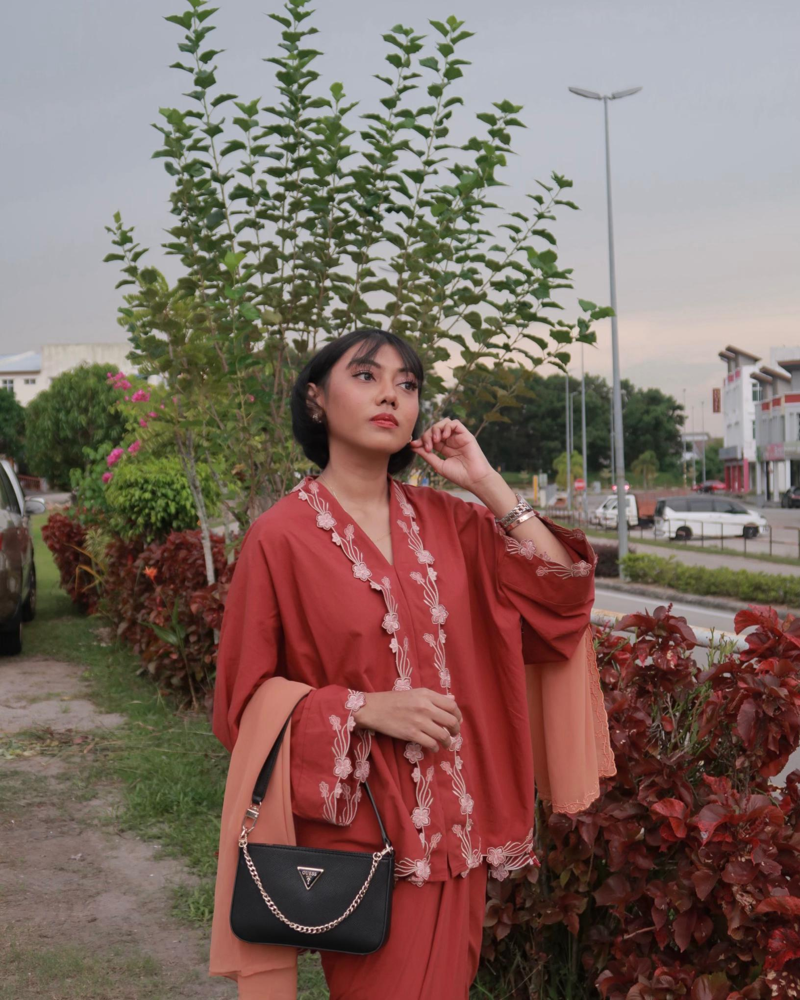

# Hey there, I'm Aina! 🌟

  

## 🎯 About Me

Hello! I'm **Aina**, a curious mind diving into the world of **Data Science** with a background in **Applied Mathematics**. Currently, I'm on a journey to master **machine learning, data analysis, and everything in between** at **UTM**. 

When I’m not wrangling data, you’ll probably find me tutoring or geeking out over math puzzles 😆

---

## 🎓 Education
- 📌 **Master’s in Data Science** (Present) - Universiti Teknologi Malaysia (UTM)
- 📌 **Bachelor’s in Applied Mathematics** (2019-2023) - Universiti Malaysia Terengganu (UMT)
  
---

## 🛠️ What I Work With

  
  
  
  

---

## 🎨 Things I Enjoy

- 📚 Reading (Mostly sci-fi & fantasy, but I love a good thriller too!)
- 🎧 Listening to music (Lo-fi beats, K-pop, and a little bit of everything)
- 🍰 Baking (I love making desserts and trying new recipes!) 
- ✈️ Exploring new places & food-hopping with friends

---

## 🚀 Experience
- **Freelance Tutor (2018-Present)** 🎓
  - Taught **SPM Mathematics, Additional Mathematics, and English**
  - Helped students *not* hate math (mission ongoing… 😆)

- **Private Tuition Team at Pandai** 🏫
  - Assisted in built dashboards using **Looker Studio** 📊
  - Assisted in online class setup & technical training 🎥

---

## 📫 Connect with Me!
- 🏡 **GitHub:** [github.com/vicheolis](https://github.com/vicheolis)
- 💼 **LinkedIn:** [linkedin.com/in/vicheolis](https://www.linkedin.com/in/nur-aina-farraain-zahanizam-0ab686223/)
- 📧 **Email:** nurainafarraain@graduate.utm.my

<!--
**vicheolis/vicheolis** is a ✨ _special_ ✨ repository because its `README.md` (this file) appears on your GitHub profile.
