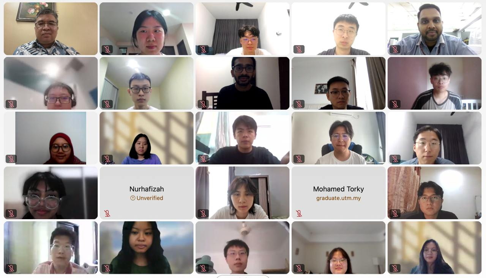

# Research Design and Analysis in Data Science (MCST1043)

## 📖 Course Synopsis
This course covers the fundamental steps and implementation of developing initial ideas into formal academic writing. Students will learn mechanisms to transform and digest literature reviews leading to a proposed title. The theoretical and practical aspects of drafting a project proposal will be the course milestone, emphasizing ordered, critical, and reasoned exposition of knowledge through student efforts.

## [Carry marks](https://github.com/drshahizan/research-design/blob/main/images/carrymarks%20RD%2024252.pdf)

## 🔥 Important Things
Stay organized and well-prepared for the course by accessing the essential resources below. These materials will help you navigate the course efficiently and maximize your learning experience.  

### ✅ **[Tasks to Complete Before the First Lecture](./24252/materials/tasks.md)**  
Ensure you complete all essential tasks before attending the first lecture. These include setting up your learning environment, accessing course materials, and preparing to actively participate in class. 📝💻  

### 🧑‍🎓 **[Student Information](./24252/student/)**  
Find your personal and academic details relevant to your student profile, including records and participation information.  
 

### 📚 **[Course Information](./images/CI%20MCSD1043%20RM%20Data%20Science%20Sem24252.pdf)**  
Get comprehensive details about the course, including learning objectives, syllabus, policies, and requirements for the current semester.  

### 📅 **[Weekly Schedule](./24252/materials/schedule.md)**  
Review the structured week-by-week breakdown of topics, activities, and key deadlines to keep up with the coursework effectively.  

### 📄 **[Master Data Science Project Handbook](./images/Project%20Handbook.pdf)**  
A comprehensive guide outlining key methodologies, best practices, and expectations for data science projects.  

### 📂 **[Teaching Module](./materials/slides.md)**  
Access all lecture slides, notes, and other instructional materials that will be used throughout the course.  
 
### 📝 **[Assignment Overview](./24252/assignment)**
Access essential documents to guide you through your coursework, including assignment details, submission guidelines, deadlines, and evaluation criteria. Proposal submissions by Batch
- [Batch 2024-25/02](./24252/proposal/readme.md)
- [Batch 2024-25/01](./proposal/proposal_2.md)  
- [Batch 2023-24/02](./proposal/readme.md)
      
### 📝 **[Exercise](./exercise)**  
Access project guidelines, datasets, and collaboration tools for hands-on data science experience.  

### 🧠 **[GitHub Repository]()**  
Explore and contribute to the course’s GitHub repository, where all coding exercises, projects, and collaborative tasks will be managed.  

### 📝 [Data Science Case Study](https://github.com/drshahizan/research-design/blob/main/materials/ds-resource.md)

### 📝 **[Additional Resources]()**  
Discover extra reading materials, research papers, and external references to deepen your understanding of the subject. 

## Contribution 🛠️
Please create an [Issue](https://github.com/drshahizan/research-design/issues) for any improvements, suggestions or errors in the content.

