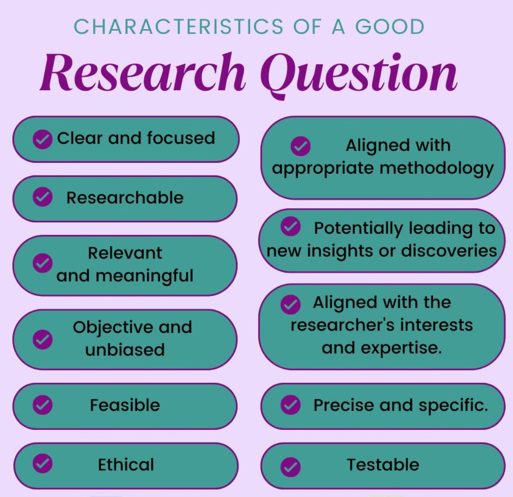

Here are the key characteristics to keep in mind when crafting a research question that shines:

✅ Clear and focused: No more beating around the bush! Your question should be crystal clear, leaving no room for ambiguity or confusion.

✅ Researchable:  Can it be answered through empirical investigation? Your question should be just the right blend of specific and broad to allow for thorough exploration.

✅ Relevant and meaningful: Does it tackle a significant gap or problem in your field? Your question should contribute meaningfully to existing knowledge.

✅ Objective and unbiased: Keep it impartial! Your question should be free from personal biases, ensuring a fair exploration of the topic.

✅ Feasible: Keep it real! Ensure your question can be tackled within the constraints of time, resources, and data availability.

✅ Aligned with appropriate methodology: Does it match your chosen research approach? Your question should fit snugly with your methodology of choice.

✅ Ethical: Respect is key! Ensure your question upholds ethical standards, safeguarding the well-being of all involved.

✅ Potentially leading to new insights or discoveries: Will it pave the way for fresh discoveries? Your question should have the potential to uncover new knowledge or perspectives.

✅ Aligned with the researcher's interests and expertise: Does it ignite your passion? Your question should resonate with your interests and skills, driving genuine enthusiasm.

✅ Precise and specific: Leave no room for guesswork! Your question should be laser-focused, avoiding vague terminology.

✅ Testable: Can it stand up to scrutiny? Your question should be ripe for empirical testing, allowing for data-driven conclusions.

PS:  What do you think is the most challenging aspect of crafting a research question?

## Contribution 🛠️
Please create an [Issue](https://github.com/drshahizan/MCSD1043/issues) for any improvements, suggestions or errors in the content.

You can also contact me using [Linkedin](https://www.linkedin.com/in/drshahizan/) for any other queries or feedback.

[![Visitors](https://api.visitorbadge.io/api/visitors?
