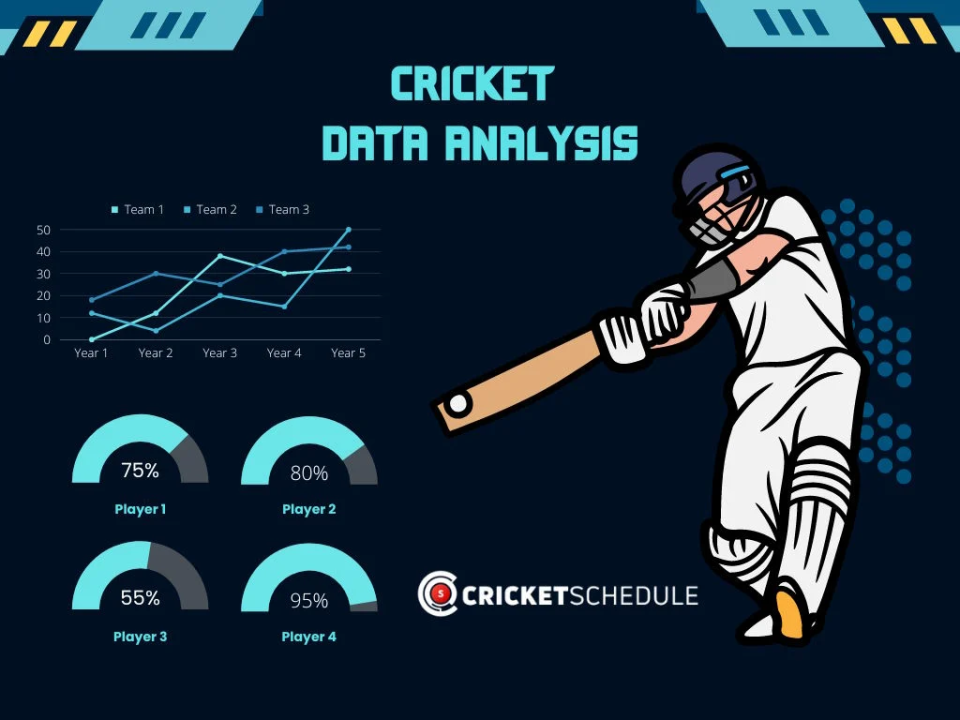
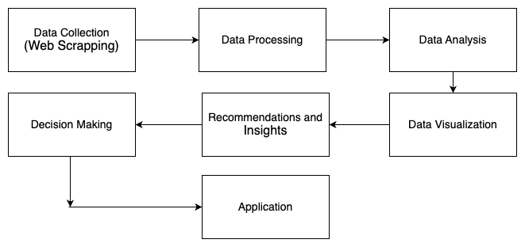

# Title: Cricket Data scraping and Analysis for Robust Data-Driven Decisions

  

| **Name:**                   | Laiba Nadeem  |
|-----------------------------|---------------|
| **Metric No:**              | MCS241005     |

# Introduction:
Cricket is a sport enriched in data. With every match played, we get loads of data that can be used to make beneficial insights to increase performance or strengthen the team. This project aims to do Cricket Data Analysis to form a team 11 in the given match scenarios: chasing a specific score or defending the score against a strong batting lineup.
By using web scrapping, python libraries, and Power BI, the project will provide comprehensive insights and solutions for our required score against or forming our strong and desired team. The goal of the project is to see how data science can turn traditional cricket strategies into robust data-driven decisions.

# Aim of the Project:
The project aims to perform data analysis techniques on the cricket data that will recommend data-driven solutions for team selection. By utilizing web scrapping to collect the data, advanced data analysis techniques, machine learning models, and Power BI visualization tools, the project will aim to provide robust data-driven solutions for team management to improve match outcomes in different scenarios.

Welcome to my proposal. Below is an outline of the chapters. You can click on each chapter to access the PDF.

# Project Chapters

Below is an outline of the chapters with links to the corresponding PDFs.

| Chapter Name               | PDF Link                                      |
|----------------------------|-----------------------------------------------|
| **Chapter 1** | [📄](Chapter%201/LaibaNadeem_Chapter1.pdf) |
| **Chapter 2** | [📄](Chapter%202/Chapter2_LaibaNadeem_MCS241005.pdf) |
| **Chapter 3**  | [📄](https://github.com/laib00/proposal/raw/main/proposal24251/laib00/Chapter%203/LaibaNadeem_Chapter3.pdf) |
| **Chapter 4** | [📄](https://github.com/laib00/proposal/raw/main/proposal24251/laib00/Chapter%204/LaibaNadeem_Chapter4.pdf) |
| **Chapter 5: Conclusion**   | [📄](https://github.com/laib00/proposal/raw/main/proposal24251/laib00/Chapter%205/LaibaNadeem_Chapter5.pdf) |

# Objectives of the Project:
1. To collect and preprocess the cricket data from various sources that include insights and players statistics. To analyze different metrics of the players like their strike rates, batting average, wicket-taking ability, and bowling economy to check their suitability for different matches.
2. To provide insights based on the match like batting order or bowling line or the placement of players in the field.
3. To provide visualization of the important insights gathered from the data using visualization tools, like Power BI.

# Process

# Applications:
<ol>
<li>Live Match Analytics for Teams and Coaches</li>
<li>Live Match Prediction</li>
<li>In-Match Fan Engagement (Live Scores and Stats)</li>
<li>Fantasy Cricket Live Data and Predictions</li>
<li>Match Commentary and Insights for Broadcasters</li>
</ol>
